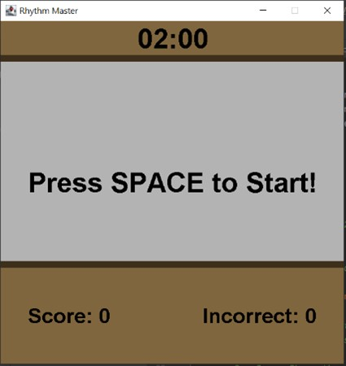
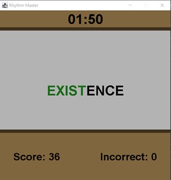
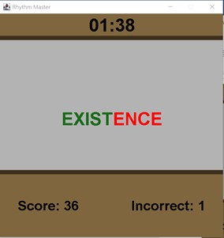
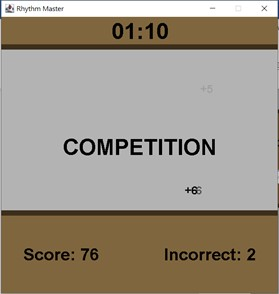
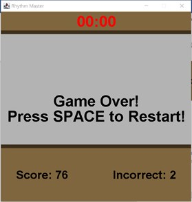

# 1.1 Word Master Game Clone Overview

**Overview written by Peter Mitchell.**

## Contents

```
1.1 Word Master Game Clone Overview 
1.2 Introduction
1.3 The Rules of Word Master 
1.4 High Level Discussion About Implementation 
1.5 How the Core Game Works
1.6 Features You Could Add
```
# 1.2 Introduction

This document will explain the fundamentals of how the Word Master game works. 

- ([Youtube Demo](https://youtu.be/sClFZwInyvM))

# 1.3 The Rules of Word Master

Word Master is a typical typing game. The rules for the game are as follow:

- The player must type in words. The game only accepts the next character in the current word
    as valid input. Any other character is considered a wrong character. Each correct character
    progresses to the next character.
- Once a word is successfully entered in full, the player is awarded with points based on the
    length of the word and the number of incorrect characters entered.
- The player can enter as many characters as possible during a 2 - minute timer.

# 1.4 High Level Discussion About Implementation

The game begins with the image to the left showing the default
state with 2 minutes, no score, and the cue to press SPACE to begin.



Once the game is started words will begin to appear that can be typed like seen below. Typing
characters correctly makes them appear in green as seen on the left. When a wrong character has
been pressed the remaining letters show as red until the next correct character is entered.

 

After each successfully entered word, the word will change, and a small text element will float
randomly showing how much score was achieved and if there were any deductions for wrong inputs.
You can see a couple of the numbers in the image below on the left. (The +5 and two +6s). Once the
timer runs out the game ends as seen in the image below on the right. The timer will show text as red
once it falls below 5 seconds remaining.

 

# 1.5 How the Core Game Works

This section will briefly summarise the classes included. For full details review the comments in the
individual files that explain what each class, method, and variable are used for.

General classes:

- ActionTimer: Tracks the amount of time that has passed. It locks at 0 when it reaches 0, and
    has a toString() method to present the current time in minutes and seconds.
- FadingEventText: Moves text slowly upward over a few seconds as it fades out to become
    invisible. Used to show score.
- Position: Tracks a position with an x and y coordinate. Used by the FadingEventText.

Core classes:

- Game: Creates and manages the JFrame.
- GamePanel: Most of the game logic is in here with almost all the rendered elements and
    changing in state.
- WordDatabase: Stores a database of words with methods to get random words out of it.

# 1.6 Features You Could Add

The following list are some of the features you could add to modify the game.

- Add words to the database to increase the number of options. (consider adding theme-based
    words).
- Improve the visuals to make it look more professional.
- Try with different rules around what characters can be entered. You could perhaps score it
    differently or change the game to require the entire word to be entered with no errors or have
    multiple words on screen with input for each word ending once a word has been fully typed.
- Store the best score and keep track of the best score between separate sessions.
- Look at what other similar typing games include in their features and implement some of
    those.
- Come up with your own unique twist and implement it on top of the game.


